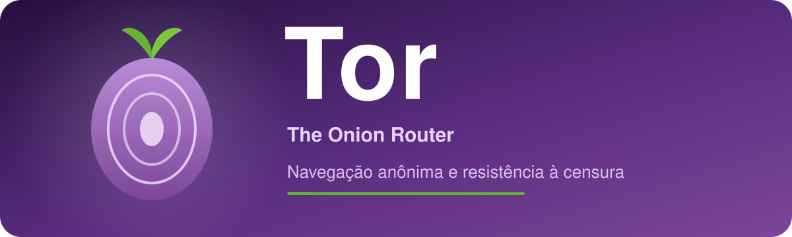
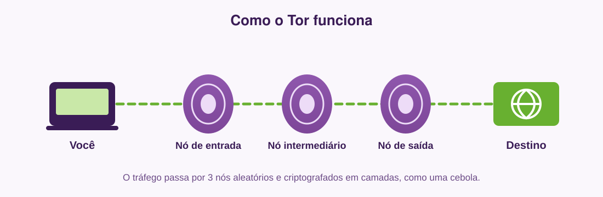

  

  
  
  
  
  

> Software livre e de código aberto para navegação anônima e resistência à censura na Internet.

---

## 📖 Descrição

O **Tor** (sigla original de *The Onion Router*) é um conjunto de protocolos e programas de código aberto, mantidos pela organização sem fins lucrativos **The Tor Project**, que permite comunicação anônima na Internet.
O Tor foi lançado publicamente em 20 de setembro de 2002

### O que é?
É uma rede de servidores voluntários que roteia o tráfego do usuário por múltiplos nós (roteamento em camadas, ou *onion routing*), de forma que nenhum ponto único da rede conheça ao mesmo tempo a origem e o destino da conexão. O produto mais conhecido é o **Tor Browser**, um navegador pré-configurado para usar essa rede.

### Para que serve?
- Proteger a privacidade e o anonimato do usuário na Internet.
- Impedir que sites, provedores e observadores da rede rastreiem a localização e os hábitos de navegação.
- Contornar censura e bloqueios de acesso a conteúdos.

### Quando deve ser utilizado?
- Ao acessar a Internet sem revelar identidade ou localização.
- Em contextos de censura, vigilância ou repressão à liberdade de expressão.
- Por jornalistas, ativistas e fontes que precisam se comunicar de forma protegida.
- Para acessar serviços *onion* (endereços `.onion`), disponíveis apenas dentro da rede Tor.

---

## 🧅 Como funciona

  

---

## 🎯 Público-alvo

- Usuários comuns preocupados com privacidade online.
- Jornalistas, ativistas e defensores de direitos humanos.
- Pessoas em países ou regiões com censura à Internet.
- Denunciantes (*whistleblowers*) e suas fontes.
- Pesquisadores de segurança e profissionais de tecnologia.
- Empresas e órgãos que precisam de comunicação resistente a vigilância.

---

## ⚙️ Funcionalidades

- Navegação anônima com ocultação do endereço IP real do usuário.
- Roteamento do tráfego por múltiplos nós (circuitos de três saltos por padrão).
- Acesso a serviços *onion* (endereços `.onion`).
- Resistência à censura por meio de *bridges* (pontes) e *pluggable transports*.
- Isolamento de circuitos por site, dificultando a correlação entre atividades.
- Bloqueio de rastreadores e proteção contra impressão digital do navegador (*fingerprinting*).
- Limpeza automática de cookies e histórico ao fechar o navegador.
- Níveis de segurança configuráveis (Padrão, Mais Seguro, O Mais Seguro).
- Extensões de segurança pré-instaladas (NoScript e modo somente-HTTPS).

---

## 🛠️ Tecnologias utilizadas

Informações baseadas na documentação e nos repositórios oficiais do The Tor Project.

| Tecnologia | Onde é usada |
|---|---|
| **C** | *Daemon* Tor original (*little-t tor* / *c-tor*), responsável pela conexão à rede — integrado ao navegador via proxy SOCKS5. |
| **Rust** | **Arti**, a reimplementação completa do Tor iniciada em 2020 e pronta para produção desde a versão 1.0.0 (2022). Escolhida por oferecer segurança de memória superior ao C. |
| **Mozilla Firefox ESR** | Base do Tor Browser. As versões estáveis atuais (Tor Browser 15.0) são construídas sobre o Firefox ESR 140. |
| **JavaScript / HTML / CSS** | Interface do navegador (herdada do Firefox). |
| **Python** | Ferramentas auxiliares e de automação do projeto. |

---

## 💻 Requisitos técnicos para utilização

Requisitos do **Tor Browser** conforme o suporte oficial do Tor Project:

- **Windows:** Windows 10 ou 11 (versões 7, 8 e 8.1 foram descontinuadas a partir do Tor Browser 14).
- **macOS:** macOS 10.15 (Catalina) ou superior.
- **Linux:** distribuições recentes com glibc 2.17 ou superior; recomenda-se sistema de 64 bits (o suporte a 32 bits x86 é encerrado no Tor Browser 16.0).
- **Android:** disponível na versão para dispositivos móveis.
- **Conexão com a Internet** ativa.
- **Espaço em disco** suficiente para a instalação do navegador (algumas centenas de MB).
- Não requer instalação com privilégios de administrador — pode ser executado a partir de uma pasta ou pen drive.

---

## 👨‍💻 Desenvolvedores

- Petterson Augusto Papa de Souza
- Paulo Henrique Alves de Almeida
- Murilo Roselini
- Raphael Souza Araujo Barbosa
- Matheus Avanzo dos Santos
- Leticia Belo do Nascimento
